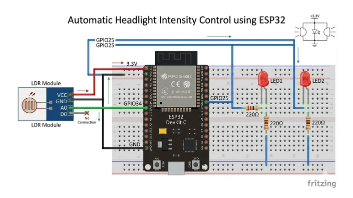
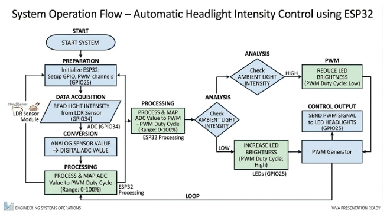

# 🚗 Automatic Headlight Intensity Control using ESP32

## 📖 Project Overview

This project automatically adjusts headlight brightness based on ambient light intensity using an ESP32 microcontroller, an LDR sensor module, PWM control, and a MOSFET driver stage.

The system reduces headlight intensity when bright light is detected and restores maximum brightness in darker conditions. This helps reduce glare and demonstrates real-time sensor-based control using embedded systems concepts.

---

## 🎯 Objectives

- Detect ambient light intensity using an LDR sensor
- Read sensor values using ESP32 ADC
- Generate PWM signals for brightness control
- Automatically adjust headlight intensity
- Demonstrate practical embedded systems design

---

## 🛠 Components Used

| Component | Quantity |
|------------|------------|
| ESP32 DevKit | 1 |
| LDR Sensor Module | 1 |
| N-Channel MOSFET | 1 |
| 5mm LEDs | 2 |
| 220Ω Resistors | 2 |
| 1kΩ Gate Resistor | 1 |
| 10kΩ Pull-down Resistor | 1 |
| Breadboard | 1 |
| Jumper Wires | Multiple |

---

## ⚙️ System Architecture

```text
LDR Sensor
     │
     ▼
ESP32 ADC (GPIO34)
     │
     ▼
Signal Processing
     │
     ▼
PWM Generation (GPIO25)
     │
     ▼
MOSFET Driver
     │
     ▼
Headlights (LEDs)
```

---

## 🔌 Circuit Connections

## Circuit Diagram



## Flowchart



### LDR Module

| LDR Module | ESP32 |
|------------|--------|
| VCC | 3.3V |
| GND | GND |
| A0 | GPIO34 |
| D0 | Not Used |

### LED & MOSFET

| Connection | Description |
|------------|------------|
| GPIO25 | MOSFET Gate (via 1kΩ resistor) |
| Source | GND |
| Drain | LED Negative Terminal |
| LED Positive | 3.3V through 220Ω resistor |

---

## 🔄 Working Principle

1. The LDR continuously senses surrounding light.
2. The ESP32 reads the analog voltage through GPIO34.
3. ADC converts the signal into digital values (0–4095).
4. The digital value is mapped to a PWM output.
5. PWM controls the MOSFET.
6. MOSFET adjusts LED brightness automatically.
7. Bright light causes dimming, while darkness restores maximum brightness.

---

## ✨ Features

- Automatic brightness adjustment
- PWM-based smooth intensity control
- Real-time ambient light sensing
- MOSFET-based load driving
- Low-cost implementation
- Expandable for automotive applications

---

## 📊 Technologies Used

- ESP32
- Embedded C
- Arduino Framework
- ADC (Analog to Digital Conversion)
- PWM (Pulse Width Modulation)
- Sensor Interfacing

---


## 📁 Project Structure

```text
automatic-headlight-intensity-control-esp32
│
├── code
│   └── automatic_headlight_control.ino
│
├── circuit_diagram.png
├── flowchart.png
├── project_report.pdf
│
└── README.md
```

---

## ⚠️ Limitations

- LDR cannot distinguish vehicle headlights from streetlights
- Performance depends on ambient conditions
- Prototype uses low-power LEDs instead of real vehicle headlights

---

## 🚀 Future Improvements

- High-power automotive LED integration
- Camera-based headlight detection
- IoT monitoring using ESP32 Wi-Fi
- OLED/LCD status display
- AI-based glare reduction algorithms

---

## 🎓 Concepts Demonstrated

- Embedded Systems
- Sensor Interfacing
- ADC
- PWM
- MOSFET Driver Circuits
- Real-Time Control Systems

---

## 👨‍💻 Author

Aganith Rai

Mini Project – Automatic Headlight Intensity Control using ESP32
